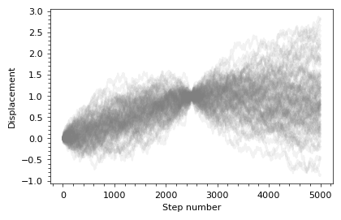

# gprob
gprob is a probabilistic programming language for Gaussian random variables with exact conditioning. It is implemented as a python package, and is built around the idea that arrays of Gaussian random variables can be manipulated in the same way numerical numpy arrays are manipulated.

To give a flavor of it, the random walk of a Brownian particle observed in the beginning at x=0 and midway through its motion at x=1 can be constructed as follows
```python
import gprob as gp
import matplotlib.pyplot as plt

nstep = 5 * 10**3  # the number of steps to walk

dx = gp.normal(0, 1/nstep, size=(nstep,))  # the random incerements
x = gp.cumsum(dx, 0)  # the unconditional particle positions
xc = x | {x[nstep//2]: 1}  # the positions conditioned on x[nstep//2] == 1

samples = xc.sample(10**2)  # sampling 100 trajectories
plt.plot(samples.T, alpha=0.1, color='gray');
```


## Requirements
The core fnctionality requires
* python >= 3.7
* [numpy](https://numpy.org/)
* [scipy](https://scipy.org/)

The package additionally implements differentiable parametric normal distributions that requires [jax](https://jax.readthedocs.io/)

## Installation

This repo contains a python package that can be installed as usual, e.g.:

1) Download the project folder 
2) Navigate the terminal to the project folder and execute `pip install .` , in which case the command will copy the files to the standard location of python packages, or `pip install -e .` , in which the command will reference the files in the folder. 

## Examples
More usage examples are in the [examples](examples) folder.

## Acknowledgements
gprob was heavily inspired by [GaussianInfer](https://github.com/damast93/GaussianInfer), accompaniying the paper

D. Stein and S. Staton, "Compositional Semantics for Probabilistic Programs with Exact Conditioning," 2021 36th Annual ACM/IEEE Symposium on Logic in Computer Science (LICS), Rome, Italy, 2021, pp. 1-13, doi: 10.1109/LICS52264.2021.9470552.

gprob aims to be more practical, numerically efficient, and have a broaded range of features.

The project uses the subscript parser from [opt-einsum](https://github.com/dgasmith/opt_einsum). Some linearization tricks follow [autograd](https://github.com/HIPS/autograd).

